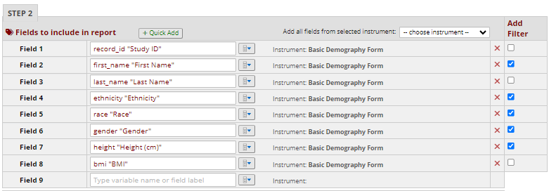
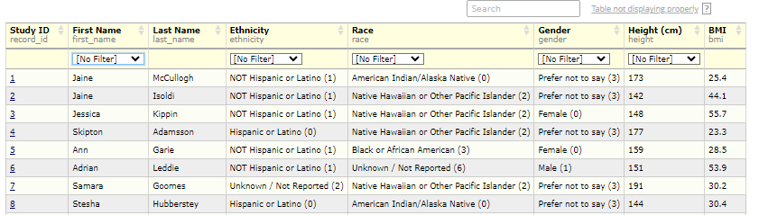
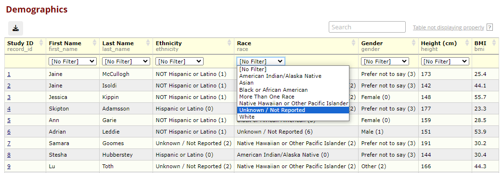
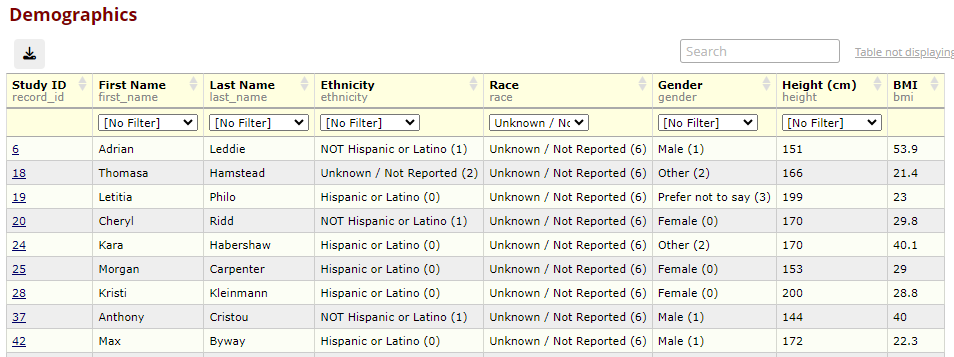
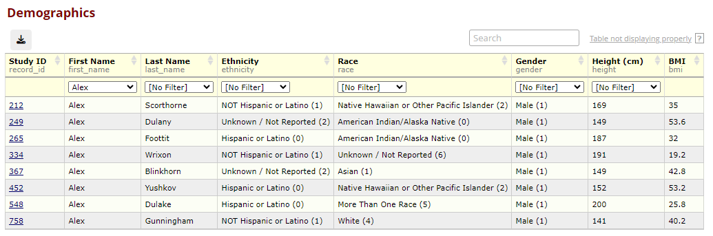

# Report Filters - Redcap External Module

More complete end-user facing documentation can be found [here](https://aanunez.io/docs/report-tweaks/)

## What does it do?

Report Filter adds the ability to add in-table, dropdown filters for select specific report fields. When enabled in a project, a "Add Filter" column is added to the "Fields to include in report" table. The selection of checkboxes in this column specify the report fields that will have an in-table dropdown filter.

The filters are added in a second row in the table header, and perform exact matches within the column.

Any field type can be utilized for this feature, including free text. For instance, in this example, the free text field "First Name" is utilized. Note, with "Alex" being selected, the name "Alexandra" is not displayed as it is not an exact match.

## Installing

You can install the module from the REDCap EM repo or drop it directly in your modules folder (i.e. `redcap/modules/report_filters_v1.0.0`).
