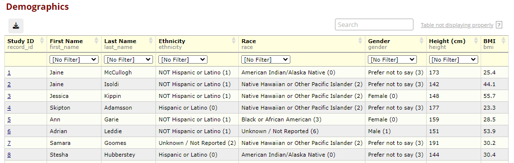

# Report Filters - Redcap External Module

More complete end-user facing documentation can be found [here](https://github.com/cchmc/redcap-em-report-filters)

## What does it do?

Report Filter adds the ability to add in-table, dropdown filters for select specific report fields. When enabled in a project, a "Add Filter" column is added to the "Fields to include in report" table. The selection of checkboxes in this column specify the report fields that will have an in-table dropdown filter.

The filters are added in a second row in the table header, and perform exact matches within the column.

Any field type can be utilized for this feature, including free text. For instance, in this example, the free text field "First Name" is utilized. Note, with "Alex" being selected, the name "Alexandra" is not displayed as it is not an exact match.

## Features

### Sendable URLs

The module supports sendable URLs, allowing for the sharing of filtered reports. When a filter is applied, the URL is updated to include the filter. This allows for the sharing of the filtered report.

### Downloadable CSV

The module supports the downloading of the filtered report as a CSV. When a filter is applied, the CSV download will include the filtered data. If the report includes both labels and raw data for the header or data rows, options will be given to download the CSV with either the labels, raw data, or both.

The download pop-up should also include any citation information that is displayed in canonical REDCap report downloads.

### Live Filter Compatibility

The module is compatible with the Live Filter module. When a live filter is applied, the in-table filters will remain.

### Multipage Compatibility

The module works when a report is split into multiple pages. The filters will remain when navigating between pages or selecting "All.

### Report Tweaks Compatibility

This module works with the popular Report Tweaks module.

## Installing

You can install the module from the REDCap EM repo or drop it directly in your modules folder (i.e. `redcap/modules/report_filters_v1.0.0`).
